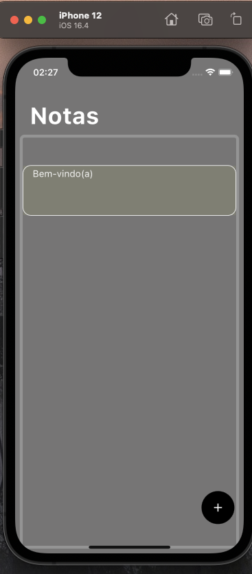
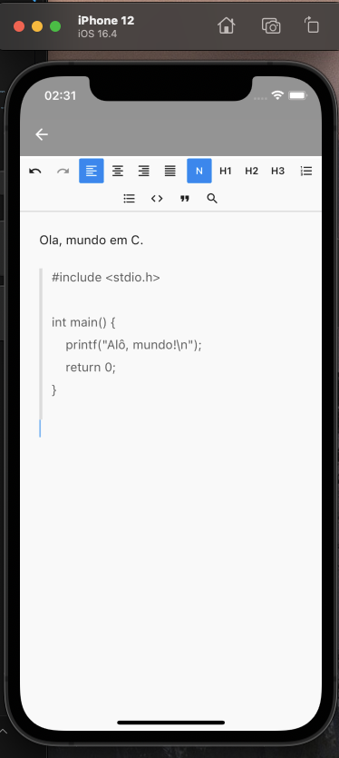
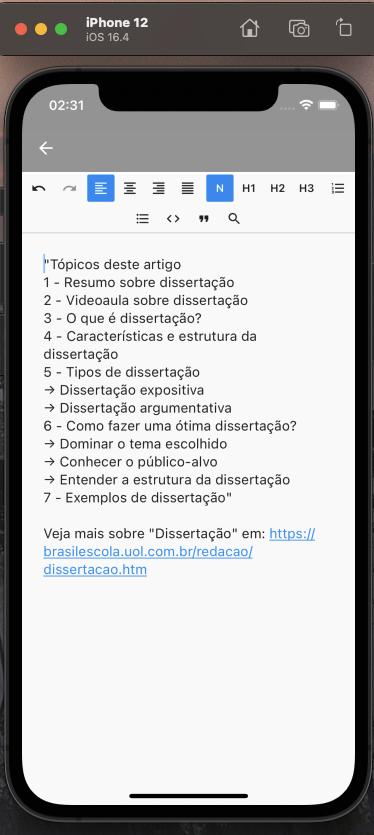

# Fast_Note.app
Aplicativo de notas Flutter - version 1.0

  

    
  

  

    
  

  

    
  

# ⚠️ OBS:

Para rodar aplicações flutter, certifique-se se sua máquina possui as seguintes tecnologias:

DART SDK
FLUTTER SDK
